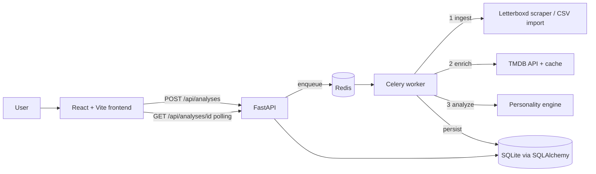

# FilmPersona 🎬

**Turn your Letterboxd history into a film personality profile.**

Type your Letterboxd username → FilmPersona scrapes your public history, enriches
every film with TMDB metadata, and computes your **film personality**: a 4-letter
type (like MBTI, but for your watchlist), one of 16 named archetypes, a world map
of your cinema, your dominant genres, and how your ratings compare to the crowd.

> Data Engineering portfolio project: the point is a clean, testable, fully
> asynchronous ETL pipeline — ingest → enrich → analyze → serve — not a black-box model.

## Architecture



The API answers in milliseconds: it validates, creates an `Analysis` row and
enqueues a Celery task. The worker runs the pipeline stage by stage, updating
`status`/`stage` as it goes; the frontend polls and renders staged progress, then
the profile.

### Ingestion (two sources, one contract)

| Source | What it provides |
|---|---|
| **Scraping** (default) | `/{user}/films/` grid (full watched history + ratings), RSS feed (recent diary: dates, rewatches, TMDB ids), profile favorites |
| **CSV export ZIP** (fallback for private profiles) | `diary.csv` + `ratings.csv` + `watched.csv` + `profile.csv` with full date fidelity |

Both normalize into the same `NormalizedEntry` dataclass, so everything downstream
is source-agnostic. All Letterboxd markup knowledge lives in **one file**
([`parsers.py`](backend/app/ingestion/letterboxd/parsers.py)) tested against saved
HTML fixtures — if Letterboxd changes its HTML, you re-save fixtures and touch
nothing else. The scraper rate-limits itself (1 req/s) and classifies failures
(`PROFILE_NOT_FOUND`, `PROFILE_PRIVATE` → the UI offers the ZIP fallback).

> Fun fact: Letterboxd's diary HTML pages sit behind a Cloudflare challenge, so the
> pipeline composes the watched grid (breadth) with the RSS feed (recent dates,
> rewatch flags, even TMDB ids) instead.

### Enrichment (two cache layers)

TMDB provides what Letterboxd doesn't publish: production countries, genres,
original language, directors, popularity, runtime.

1. **Durable cache** — the `films` table stores every resolved film forever;
   analysis #2 of a cinephile who overlaps with analysis #1 only hits TMDB for
   the difference.
2. **Redis (24h)** — negative cache for unresolvable titles, plus a 24h reuse
   window for whole analyses of the same username.

### Personality model v1 (rules + scoring, versioned)

Pure functions: `entries → FeatureSet → 4 axis scores (0-100) → 4-letter code →
archetype`. No I/O anywhere in the model, so it unit-tests with synthetic diets
(a 100% Marvel diet must classify `MLFH`; a Korean-Argentine festival diet `AGEC`).

| Axis | Poles | Main signals |
|---|---|---|
| What you reach for | **M**ainstream ↔ **A**rthouse | median TMDB popularity, share of blockbusters |
| Where films come from | **L**ocal ↔ **G**lobal | country entropy, % non-English |
| How you explore | **F**aithful ↔ **E**xplorer | genre entropy, director concentration, rewatch rate |
| How you rate | **H** Enthusiast ↔ **C**ritic | your ratings vs TMDB crowd average |

Every threshold/weight lives in
[`personality/config.py`](backend/app/analysis/personality/config.py) under a
`MODEL_VERSION` that is persisted with each profile — iterating the model is a
config bump, not a pipeline rewrite.

## Stack

React 19 · TypeScript · Vite · Tailwind 4 · Recharts · d3-geo — FastAPI ·
SQLAlchemy 2 · Alembic · Celery · Redis · httpx + BeautifulSoup — uv · just ·
pytest · vitest · Playwright · GitHub Actions.

## Quickstart

Prerequisites: [uv](https://docs.astral.sh/uv/), [just](https://github.com/casey/just)
(`uv tool install rust-just`), Node ≥ 20, Docker Desktop, a free
[TMDB API key](https://www.themoviedb.org/settings/api).

```bash
cp backend/.env.example backend/.env    # add your TMDB_API_KEY
cd backend && uv sync && cd ..
cd frontend && npm install && cd ..
just dev                                # Redis + API + Celery worker + frontend
```

Open http://localhost:5173 and type a Letterboxd username.

## Development

```bash
just ci             # lint + backend tests + frontend tests — exactly what CI runs
just test           # pytest (52 tests: parsers vs real HTML fixtures, model diets, API)
just test-frontend  # vitest component tests
just e2e            # Playwright: full user flow against a mocked API
just fmt            # ruff + prettier autoformat
just migrate "msg"  # new Alembic migration
```

CI (GitHub Actions) runs `just ci` on every push/PR — the same entrypoint you run
locally, so CI can't drift from the dev loop.

## Design decisions worth asking me about

- **Why scraping + RSS instead of an official API?** Letterboxd's API is
  invite-only. The scraper is isolated behind a normalized contract, rate-limited,
  and fixture-tested; the CSV export upload covers private profiles and is also
  the archival-quality path.
- **Why rules + scoring instead of ML for v1?** With one user's history there is
  nothing to cluster. A deterministic, explainable scorer ships value now, is
  trivially testable, and the `FeatureSet` it computes *is* the future training
  set once enough profiles exist.
- **Why Celery + Redis for a "small" app?** A scrape+enrich of a 2,000-film
  history takes minutes — you can't hold an HTTP request open for that. The queue
  buys progress reporting, retries, and horizontal scaling of workers for free.
- **Why SQLite?** Zero-ops for a portfolio deployment; every query goes through
  SQLAlchemy, so the swap to Postgres is a `DATABASE_URL` change plus
  `alembic upgrade head`.

## Roadmap

Friend-comparison profiles · personalized recommendations · a December-ready
"Cine Wrapped" share card · plan gating (architecture in place, no payments).

---

*This product uses the TMDB API but is not endorsed or certified by TMDB. Not
affiliated with Letterboxd.*
